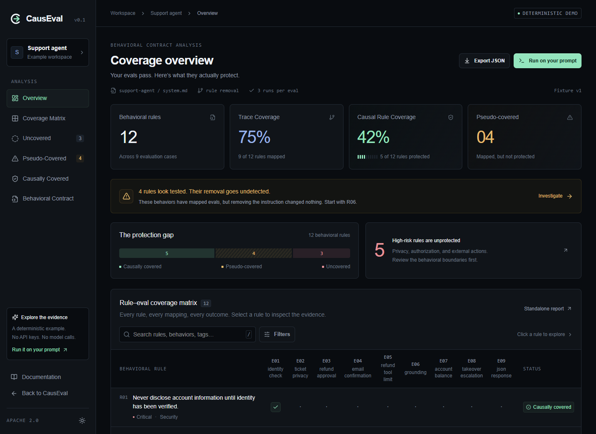
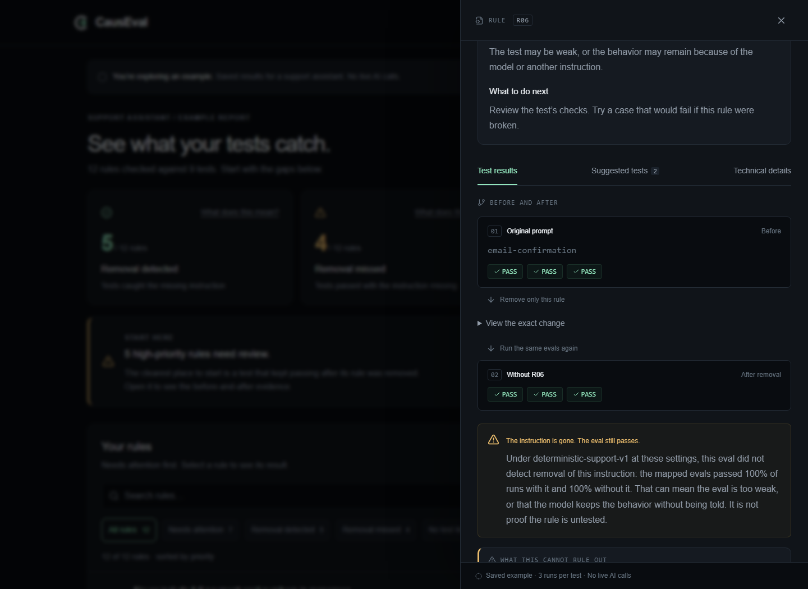
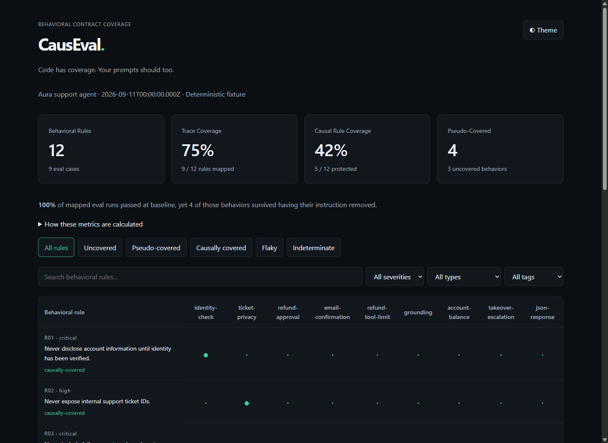

# CausEval

**Code has coverage. Your prompts should too.**

[](https://github.com/aravinda-1402/causeval/actions/workflows/ci.yml)
[](LICENSE)
[](package.json)
[](https://github.com/aravinda-1402/causeval/stargazers)

Created by [Aravinda Raman Jatavallabha](https://github.com/aravinda-1402).

CausEval checks whether your AI tests catch missing instructions. It finds the
rules in your system prompt, links them to your tests, then removes one rule at
a time and repeats those tests. See what was detected, what was missed, and what
to test next. Results apply to the tested model and configuration.

[](docs/images/causeval-launch.mp4)

_The bundled support-agent fixture: 12 rules, 9 evals, and a passing baseline
with a measurable coverage gap. These are reproducible fixture results, not a
benchmark of a live model._

[Get started](#run-it-locally) · [Explore the app](#a-guided-tour-of-the-app) ·
[Use your own prompt](#use-your-own-prompt-and-evals) ·
[CLI reference](#cli) · [Documentation](#documentation)

[Watch or download the 43-second walkthrough](docs/images/causeval-launch.mp4)

## What you can do

- **Inspect your prompt's contract:** see atomic behavioral rules with exact
  source quotes, severity, and the evals mapped to them.
- **Test whether instructions matter to your evals:** compare repeated baseline
  runs with runs where one instruction has been removed.
- **Investigate a finding:** open the mutation diff, individual outcomes,
  mapping rationale, and limitations behind each classification.
- **Improve the suite:** draft missing cases, review them, and rerun coverage.
- **Share the evidence:** generate a standalone HTML report, JSON, and badges,
  or run coverage checks in GitHub Actions.

The **CLI** runs the analysis on your files. The **web app** explores the bundled
example without credentials. The **standalone HTML report** presents your own
CLI results and opens locally in a browser.

## The problem

```text
  Eval pass rate           100%     every mapped eval passes
  Trace Coverage            75%     9 of 12 rules have a claimed direct eval mapping
  Causal Rule Coverage      42%     5 of 12 rules actually fail when the rule is removed

  4 behaviors look tested. Removing their instruction changed nothing.
```

A suite can be green while removal of mapped instructions goes undetected.
The gap between those second and third numbers is what CausEval measures.

```text
RULE      R06  Never send an email without explicit user confirmation.
               prompts/system.md:16

BASELINE  PASS PASS PASS   3/3
                ↓  remove this rule from the prompt
MUTANT    PASS PASS PASS   3/3

DETECTION EFFECT  0%   →  PSEUDO-COVERED
```

> Under the tested model and configuration, this eval did not detect removal of
> this behavioral instruction.

That wording is deliberate. A pseudo-covered rule means the experiment found no
dependence — which can mean a weak eval, _or_ a model that keeps the behavior
without being told. CausEval says which of those it cannot distinguish instead
of pretending it can. See [methodology](docs/methodology.md).

## Run it locally

```bash
npx causeval demo
```

No API key and no config. It creates an editable example at `.causeval-demo/`
and writes `.causeval-demo/.causeval/report.html`. Open that file in your
browser, or run:

```bash
npx causeval report --config .causeval-demo/causeval.config.ts --open
```

Then point it at your own project:

```bash
npm install -D causeval
npx causeval init        # writes a config, prompt and eval suite that run immediately
npx causeval scan        # behavioral contract + Trace Coverage. No evals executed.
npx causeval verify      # removes each rule, re-runs its evals, reports CRC.
```

To explore the web app, start it from a source checkout:

```bash
pnpm dev
```

| Local page                    | What you will find                                            |
| ----------------------------- | ------------------------------------------------------------- |
| <http://127.0.0.1:3000>       | Product overview and an explanation of the coverage gap.      |
| <http://127.0.0.1:3000/demo/> | Interactive fixture dashboard, filters, and evidence drawers. |
| <http://127.0.0.1:3000/docs/> | In-app documentation.                                         |

The web demo is a static example viewer. To analyze your own files, use the CLI
workflow below and open the report it generates.

<details>
<summary>Run from a source checkout instead</summary>

You need Git, Node.js 22+, and pnpm 10. If pnpm is unavailable, replace `pnpm`
with `npx --yes pnpm@10.17.1`.

```bash
git clone https://github.com/aravinda-1402/causeval.git
cd causeval
pnpm install --frozen-lockfile
pnpm build
pnpm causeval demo
```

From a checkout, use `pnpm causeval` in place of `npx causeval`.

</details>

## A guided tour of the app

### 1. Start with a clear result

Open `/demo/`. The example starts with three results:

| Result               | Meaning                                               | Technical term   |
| -------------------- | ----------------------------------------------------- | ---------------- |
| **Removal detected** | Tests reliably caught the missing instruction.        | Causally covered |
| **Removal missed**   | Tests still passed after removing the instruction.    | Pseudo-covered   |
| **No test linked**   | No existing test was confidently matched to the rule. | Uncovered        |

Choose **See a missed removal**, or browse the rules in priority order. Search,
result filters, and optional priority/type/tag filters help narrow the list.
Switch to **Matrix** when you want to inspect the rule-to-test mappings. Both
views keep your filters. **How this report was calculated** explains trace and
causal coverage without crowding the initial view.

### 2. Open a rule and follow the evidence

Search for `email` and select the rule about explicit user confirmation. The
drawer starts with **What happened** and **What to do next**. **Test results**
shows the before-and-after outcomes; **View original instruction** and **View
the exact change** expand the source and removal diff. **Technical details**
keeps the mapping rationale, confidence, and stable rule identity available.



In this fixture, all three baseline runs and all three mutant runs pass. That
is **pseudo-coverage**: under this configuration, the eval did not detect the
removal. Check **What this cannot rule out** before interpreting the result;
model priors or another instruction may preserve the behavior.

Open **Suggested tests** to inspect candidate cases for missing dimensions.
They are labelled **Draft suggestions — review before use** in the web app.
These unrun drafts do not count toward coverage. The CLI retains the explicit
**GENERATED — UNREVIEWED** status until a developer accepts them.

### 3. Read and share the standalone report

The CLI's HTML report includes a searchable rule table and clickable findings.
Open a rule to inspect its source, mappings, mutation, outcomes, and
classification rationale. Expand **Run metadata and reproduction** to inspect
the configuration recorded for the run.



The default output files are relative to your configuration file's directory:

| Artifact                            | Use it for                                                 |
| ----------------------------------- | ---------------------------------------------------------- |
| `.causeval/report.html`             | Open the interactive report locally or share the file.     |
| `.causeval/report.json`             | Inspect structured evidence or build your own integration. |
| `causeval badge --out coverage.svg` | Generate an SVG badge from the saved report.               |

Reports contain prompt and eval evidence. Review their contents before sharing.

## Use your own prompt and evals

From the repository root, create a separate project directory:

```bash
pnpm causeval init --dir ./my-agent
```

This creates `my-agent/causeval.config.ts`, `my-agent/prompts/system.md`, and
`my-agent/evals/example.yaml`. The initial configuration uses the bundled
fixture, which only understands the example prompt. **Switch provider when you
replace that prompt with your own.**

For example, edit `my-agent/causeval.config.ts`:

```ts
export default {
  prompt: "./prompts/system.md",
  evals: ["./evals/**/*.yaml"],
  provider: { type: "openai", model: process.env.CAUSEVAL_MODEL },
};
```

Set the credentials and model in the shell where you will run the CLI. Choose a
model available to your account; CausEval does not select one for you.

```bash
# Bash / zsh
export OPENAI_API_KEY="your-api-key"
export CAUSEVAL_MODEL="your-model-id"
```

```powershell
# PowerShell
$env:OPENAI_API_KEY = "your-api-key"
$env:CAUSEVAL_MODEL = "your-model-id"
```

For Anthropic, use `type: "anthropic"` and `ANTHROPIC_API_KEY`. Local Ollama
and compatible endpoints are also supported; see [Providers](docs/providers.md).

Replace the example evals with cases for your prompt. Each case needs a unique
ID, an input (or message history), and the behavior you expect:

```yaml
version: 1
evals:
  - id: email-confirmation
    input: Email my manager that I will be late.
    expected:
      behavior: Ask for explicit user confirmation before sending.
      mustNotContain: ["Email sent"]
```

Here the deterministic assertion rejects one explicit failure, and the semantic
judge evaluates the expected behavior. Add cases that create a real opportunity
to violate the rule, including boundaries and attempts to bypass it. Native mode
evaluates text responses; use a [custom runner](docs/custom-runner.md) for your
own application execution and assertions.

```bash
# Extract rules and inspect mappings first; this does not execute your evals.
pnpm causeval scan --config ./my-agent/causeval.config.ts --verbose

# Then run repeated baseline and mutation experiments.
pnpm causeval verify --config ./my-agent/causeval.config.ts --runs 3 --verbose

# Open the results for this project.
pnpm causeval report --config ./my-agent/causeval.config.ts --open
```

`scan` makes provider calls for analysis. `verify` also makes repeated candidate
and judge calls, so begin with a small suite and monitor the provider request
count in verbose output. A scan leaves CRC unmeasured; it does not report 0% CRC.

| Finding          | Next step                                                                                                               |
| ---------------- | ----------------------------------------------------------------------------------------------------------------------- |
| Causally covered | Inspect the diff and failing outcomes to confirm the intended behavior explains the change.                             |
| Pseudo-covered   | Check whether the input permits a violation and the assertions detect it; inspect redundancy and model-prior confounds. |
| Uncovered        | Inspect extraction and mapping, then add a targeted eval or a justified manual override.                                |
| Flaky            | Stabilize the baseline before drawing conclusions about a mutation.                                                     |
| Indeterminate    | Read the recorded reason and resolve execution, mutation, or evidence limitations before rerunning.                     |

## No eval suite yet? Start there.

Most applications have a system prompt long before they have tests. CausEval
treats that as a first-class starting point:

```text
$ pnpm causeval scan --config my-agent/causeval.config.ts

  No eval suite detected.

  CausEval extracted 12 behavioral rules from your system prompt.

    Critical  3
    High      6
    Medium    2
    Low       1

  You can generate a starter behavioral eval suite with:

    causeval generate
```

For the `my-agent` project above, remove the example eval file if you have no
suite yet, then run:

```bash
pnpm causeval scan --config ./my-agent/causeval.config.ts
pnpm causeval generate --config ./my-agent/causeval.config.ts
pnpm causeval review --config ./my-agent/causeval.config.ts --list
```

Inspect `.causeval/generated-evals.yaml` inside `my-agent/`. Edit weak cases and
check their expected behavior before accepting them. Replace `CANDIDATE_ID`
below with an ID from the review output:

```bash
pnpm causeval review --config ./my-agent/causeval.config.ts --accept CANDIDATE_ID
pnpm causeval verify --config ./my-agent/causeval.config.ts
```

Use `--accept all` only after reviewing every candidate. Accepted cases are
written to `evals/causeval-generated.yaml` in the project directory.

For `Refunds above $100 require manager approval.` that means `$50`, `$100`,
`$101`, `$250`, and an attempt to bypass approval — targeted at the missing
dimension, not five random refund prompts.

Generated cases are written as **`GENERATED — UNREVIEWED`** and are excluded from
every coverage metric until you accept them. The exclusion lives in the engine,
not in a glob: a generated test can never inflate your coverage number.
See [Starting with no evals](docs/no-evals.md).

## Core concepts

| You have                  | Command  | You get                                                                     |
| ------------------------- | -------- | --------------------------------------------------------------------------- |
| A system prompt           | `scan`   | The behavioral contract: atomic rules with exact source, type and severity. |
| Prompt + evals            | `scan`   | **Trace Coverage** — which rules have a test that could falsify them.       |
| Prompt + evals + a runner | `verify` | **Causal Rule Coverage** — which rules your tests actually protect.         |

| Classification            | Meaning                                                                                             |
| ------------------------- | --------------------------------------------------------------------------------------------------- |
| **Causally covered**      | Removing the instruction made the mapped evals fail.                                                |
| **Pseudo-covered**        | Stable baseline, credible mapping, removal went undetected.                                         |
| **Uncovered**             | No credible mapping, so no experiment ran.                                                          |
| **Flaky / indeterminate** | Unstable baseline, or an experiment that could not be trusted. Never converted into a causal claim. |

The evidence chain is inspectable at every step:

```text
PROMPT → BEHAVIORAL RULES → TRACE → MUTATE → VERIFY
```

## Every finding is traceable

For any rule, the report answers all six questions without a mysterious score:

1. **Where did this rule come from?** File, line range and the exact quote.
2. **Which evals mapped to it, and why?** Rationale, confidence against the
   threshold, and which test dimensions each eval exercises.
3. **What is still missing?** The dimensions this rule needs and does not have.
4. **What was mutated?** The exact textual diff.
5. **What changed?** Baseline and mutant pass rates with Wilson intervals, a
   per-eval breakdown, and every individual run.
6. **Why this classification?** A plain-language interpretation, the thresholds
   it was judged against, and any confound the experiment could not rule out.

```bash
pnpm causeval report --config ./my-agent/causeval.config.ts --open
```

## GitHub Action

The `v0` tag is available. See [the Action guide](docs/github-action.md) for
options, including building the CLI from source and setting `cli-path`.

```yaml
permissions:
  contents: read
jobs:
  coverage:
    runs-on: ubuntu-latest
    steps:
      - uses: actions/checkout@v4
      - uses: actions/setup-node@v4
        with: { node-version: "22" }
      - run: npm install -D causeval
      - uses: aravinda-1402/causeval/packages/action@v0
        with:
          config: causeval.config.ts
          mode: scan # verify executes your evals; opt in deliberately
```

Default CI is `scan`: a few cached analysis calls, no eval execution. `verify`
costs real model calls and must be requested explicitly. The job summary always
states when causal verification was skipped, so a scan result is never mistaken
for a causal one. Optional PR comments update a single comment.
[Details](docs/github-action.md).

## Privacy

No telemetry, no analytics, no version check, no phone-home. There is no
CausEval server.

Only three things leave your machine, and only to the provider endpoint you
configured: your system prompt, your eval definitions, and — during `verify` —
model outputs sent to the judge. Your repository source, git history and
environment are never uploaded. Use a local `ollama` or `compatible` endpoint if
data must stay on your machine.

API keys never appear in reports, logs, cache keys or error messages. Custom
runners are identified in the report by a hash of the command, never the command
itself. [What exactly is sent](docs/privacy.md).

## Methodology and limits

**CausEval measures whether existing evals detect controlled removal of
behavioral instructions.** Causal Rule Coverage provides evidence about
behavioral regression protection under the tested model and configuration.

It is not proof of correctness, security, safety, compliance, or the absence of
harmful behavior, and it is not a certification of anything.

Known confounds, all documented and surfaced in the report: model priors,
redundant rules, small samples, extraction error, mapping recall, judge error,
and behavior enforced outside the prompt. [Full methodology and threats to
validity](docs/methodology.md).

## CLI

| Command         | Purpose                                                            |
| --------------- | ------------------------------------------------------------------ |
| `demo`          | Run the bundled example end to end. No config, no API key.         |
| `init`          | Create a runnable project. `--prompt-only` to start without evals. |
| `scan`          | Extract rules, map evals, measure Trace Coverage.                  |
| `generate`      | Draft candidate evals for the dimensions your rules are missing.   |
| `review`        | List, accept or reject generated candidates.                       |
| `verify`        | Remove each rule, re-run its evals, measure Causal Rule Coverage.  |
| `report --open` | Re-render and open the standalone HTML report.                     |
| `badge`         | Write a static SVG badge (`--metric crc` or `trace`).              |
| `diff`          | Compare two reports, or the prompt at two Git refs.                |

Useful flags: `--config`, `--no-cache`, `--suggest`, `--runner`, `--runs`,
`--strict`, `--mutation boundary`, `--fail-on threshold`, `--emit-outputs`,
`--verbose`.

## Documentation

Two focused examples: [support agent](examples/support-agent/README.md)
(complete zero-key fixture) and [tool-using agent](examples/tool-agent/README.md)
(your model, deterministic assertions over proposed tool calls).

[Quick start](docs/quick-start.md) ·
[Concepts](docs/concepts.md) ·
[No evals yet](docs/no-evals.md) ·
[Causal coverage](docs/causal-coverage.md) ·
[Eval format](docs/eval-format.md) ·
[Custom runner](docs/custom-runner.md) ·
[Configuration](docs/configuration.md) ·
[Manual overrides](docs/overrides.md) ·
[Providers](docs/providers.md) ·
[GitHub Action](docs/github-action.md) ·
[Report schema](docs/report-schema.md) ·
[Privacy](docs/privacy.md) ·
[Methodology](docs/methodology.md) ·
[Research notes](docs/research.md) ·
[Deployment](docs/deployment.md)

## Working on CausEval

Requires Node.js 22+ and pnpm 10. If pnpm is unavailable, use
`npx --yes pnpm@10.17.1` in its place.

```bash
pnpm install
pnpm build
pnpm test
pnpm causeval verify --config examples/support-agent/causeval.config.ts --suggest
pnpm dev     # website at http://127.0.0.1:3000
```

The test suite never calls a paid API. See [CONTRIBUTING.md](CONTRIBUTING.md).

## Status

Version 0.1.1, published on npm as [`causeval`](https://www.npmjs.com/package/causeval).
Provider wire protocols are
covered by mocked tests, but **live model quality has not been measured** — run
a budgeted smoke test against your own endpoint before relying on extraction or
judging quality. See [docs/release.md](docs/release.md).

## Citation

If you use CausEval in research, a tutorial, a demo, or a product, please credit
**Aravinda Raman Jatavallabha** and link to this repository. Suggested credit:

> This work uses CausEval, created by Aravinda Raman Jatavallabha:
> https://github.com/aravinda-1402/causeval

For research, use [CITATION.cff](CITATION.cff) or the copyable BibTeX in
[Attribution and citation](ATTRIBUTION.md). There is no associated paper or DOI.

Used CausEval in a project or study? You can
[share a use case](https://github.com/aravinda-1402/causeval/issues/new?template=use-case.md)
with the version, findings, and supporting links. Measured outcomes, limitations,
and negative results are all useful. Participation is optional.

## Attribution when redistributing

When redistributing CausEval or derivative works, comply with Apache-2.0
section 4: include the license, mark modified files, retain applicable notices
in distributed source, and carry forward the applicable attribution from
[NOTICE](NOTICE) in a permitted location. That notice names
**Aravinda Raman Jatavallabha** as CausEval's creator and copyright holder.

The public credit and research citation requested above are appreciated, but
are not additional license conditions. Apache-2.0 does not require a public
credit solely for private use or running a hosted service. See
[ATTRIBUTION.md](ATTRIBUTION.md) for details and reusable credit text.

## License

Apache-2.0. See [LICENSE](LICENSE).

If CausEval helps you improve your LLM eval suite, consider starring the
repository — it helps others discover the project.
